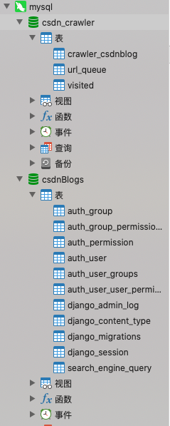

# 			CSDN爬虫+搜索引擎	

### 1.项目介绍

爬取CSDN博客，利用Whoosh实现倒排索引与排序，django作为后端实现小型CSDN搜索引擎。并实现高亮、相关搜索等功能。

### 2.效果展示


详细效果请见展示.pdf

### 3.环境：

python3.6 + django2.1 + 若干python库

### 4.配置

#### （1）django settings.py

```python
DATABASES = {
    'default': {
        'ENGINE': 'django.db.backends.mysql',
        'NAME': 'csdnBlogs',#配置query存储{
        #                                id, query, date}
        'USER': 'root',#用户名
        'PASSWORD': 'password',#数据库密码
        'HOST': '127.0.0.1',#默认端口
        'PORT': '3306',
    }
}
```

#### （2）爬虫部分 \search_engine\csdn_crawler.py

```
driver = webdriver.Chrome(executable_path='/home/chromedriver')
        # 要加chromedriver绝对路径 or 把chromedriver加到系统PATH里
```

下载chromedriver，并添加绝对路径。

```
username = driver.find_element_by_id('all')
password = driver.find_element_by_id('password-number')
username.send_keys("username") #输入csdn的账号密码
password.send_keys("passward")
click = driver.find_element_by_xpath('//button[@data-type="account"]')
```

#### （3）连接数据库配置 

```
# 数据库配置
host = ''   
user = ''
password = ''
dbname = ''  # 数据库名字
```
####  (4)数据库格式

模式名对应数据库配置里的user



### 5. 文件介绍

csdn_crawler.py ： 爬虫模块，包含模拟登陆。保存数据库

searcher.py ： 利用whoosh建立倒排索引和排序。搭建搜索引擎

DBsettings.py ： 数据库配置文件

views.py:  后端处理

word2vec.py ： 读取文本，训练模型来实现相关搜索。目前效果还不太理想。模型要保存在/data/word2Vec/model

### 6.备注

（1） 实现过程：先爬虫爬取数据，再建立索引排序，最后前后端。

（2） 新手项目，如有问题，多多指教！
